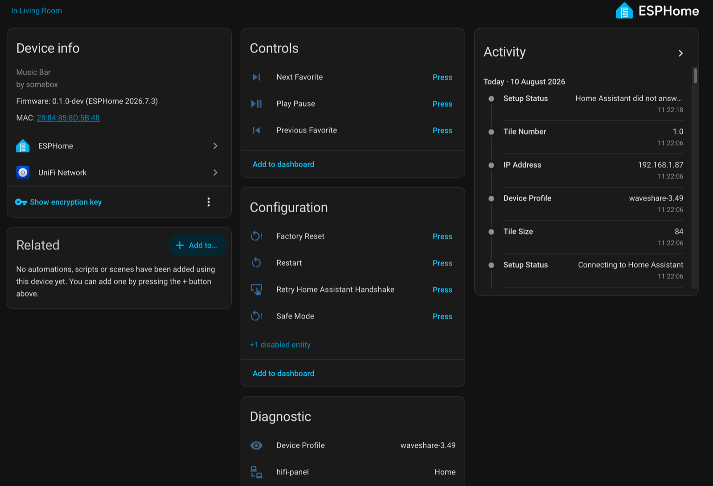
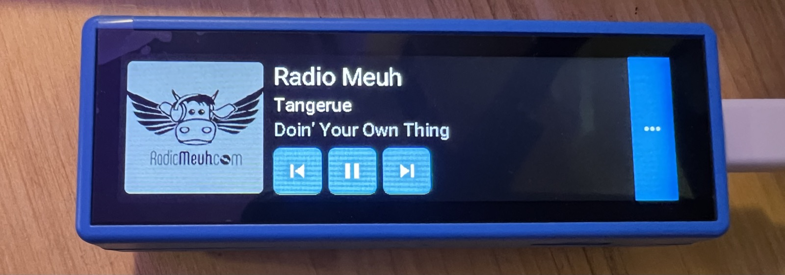

# esphome-music-bar

A quick way to put one of your **Music Assistant** favorites on a speaker.

An ESPHome touch bar that sits next to the speaker, shows what's playing, and
lets you pick something else in one tap. **Prev and next move between your
favorites, not between tracks** — it's a station selector, not a second remote
control for whatever is already playing.

- **Favorites are the content.** Whatever you've marked favorite in Music
  Assistant is what the bar offers. No config file of station names to maintain.
- **Pick the speaker** in Home Assistant; anything Music Assistant can drive
  works, because the panel never talks to a player directly.
- **Playlists resume** where you left off instead of restarting.
- **Nothing is baked in.** Favorites, artwork and the player are all read at
  runtime, so changing them never means reflashing.

Runs on the **Waveshare ESP32-S3-Touch-LCD-3.49** — a 640×172 touch bar — which
is the only device supported today. Everything board-specific lives in one
device profile, so adding another is a new file rather than a refactor. Issues
asking for a device, and pull requests adding one, are both welcome.

- [`docs/spec.md`](docs/spec.md) — the design, and the constraints behind it
- [`docs/adoption.md`](docs/adoption.md) — how discovery, provisioning and
  adoption work, and the security model
- [`docs/plan.md`](docs/plan.md) — where this came from, what is next, and
  which decisions are settled

## Status

**Early.** What exists today:

| Piece | State |
|---|---|
| Provisioning, adoption, diagnostics | **Working on hardware** — flashed, provisioned over Wi-Fi, adopted with a Home Assistant-generated encryption key that survives a reboot |
| The device→Home Assistant contract | **Built** — exposed as entities, so the panel is drivable before the screen exists |
| Artwork normalizer | **Built** — tested against a live library |
| Device-drawn monograms (the shared hash) | **Built** — device and script verified to agree |
| Blueprints (favorites, prev/next, now playing) | **Built** — validated offline; the round trip is not yet confirmed against a live Home Assistant |
| Display, LVGL layout, tiles, transport | **Not written** — waiting on the prior `hifi-panel` build |
| Artwork integration and playlist resume | **Not written** |

> **The screen shows random noise, and that is expected.** This firmware does
> not configure the display yet, so the panel never initialises the LCD and it
> shows whatever was in its memory at power-on. The device is working — it
> provisions, adopts, reports diagnostics and drives playback from its Home
> Assistant entities. Only the screen is missing. Check **Setup Status** rather
> than the glass.

Measured on the reference panel rather than assumed: PSRAM comes up as 8192 KB
octal at 80MHz, and the factory image uses 42.5% of internal RAM with no
display in it — which is the budget the framebuffer has to fit alongside.

It descends from a working private build, so the hard parts are known rather
than guessed. Anything in the spec marked *proven* was measured, not assumed.

## How it fits together

Three layers, and only the first is specific to this panel.

**The firmware.** Fixed widgets, no content — it renders whatever it is handed,
and knows nothing about Music Assistant or artwork sizing.

**Blueprints.** Read your favorites from Music Assistant, page them, work out
what "next favorite" means, and push it all into the panel. Ordinary Home
Assistant config: import, pick your player, done.

**The artwork normalizer.** Returns every image at identical dimensions,
filling gaps from your own override folder. Optional — see below.

## What you get at each step

| Installed | Browser tiles | Now Playing artwork |
|---|---|---|
| Firmware only | Monograms drawn by the panel | none (text only) |
| \+ blueprints | Monograms drawn by the panel | live from Music Assistant |
| \+ artwork integration | Your artwork, at a fixed size | live from Music Assistant |

Playlist resume needs the artwork integration too — it requires a Music
Assistant token, which blueprints don't have. Without it, playlists start from
the top.

The panel draws its own monograms — an item's initials on a colour derived from
its name — so the browser works with nothing installed beyond the firmware and a
blueprint. Artwork is an upgrade, not a prerequisite.

That matters more than it looks. ESPHome reallocates a runtime image's buffer
whenever the decoded dimensions change, and varying artwork sizes fragment PSRAM
until the panel falls over ([`docs/spec.md` §4](docs/spec.md#4-artwork)). With no
artwork configured, no image slot is ever handed a URL and there is nothing to
fragment. With artwork configured, the normalizer's fixed-size guarantee is what
makes it safe.

## Hardware

- **Board**: Waveshare ESP32-S3-Touch-LCD-3.49. AXS15231B QSPI display and
  capacitive touch (one chip drives both), 172×640 native portrait, used
  rotated 90° as a 640×172 landscape bar. 16MB flash, octal PSRAM.
- **Also on board**: QMI8658 IMU on a second I²C bus (GPIO47/48), for
  auto-rotating the display when the panel is mounted the other way up.
- **Power**: mains. There is a battery circuit; this project does not use it.

## Requirements

- Music Assistant 2.10 or newer, reachable over plain HTTP on the LAN
- Home Assistant with the Music Assistant integration
- ESPHome 2026.7.3 or newer

The project tracks current releases of both rather than carrying compatibility
shims — the features it leans on (runtime encryption keys, correct LVGL touch
rotation, playlist `start_item`) are all recent.

## Installing

### The panel

No secrets, and nothing to edit. Flash it, provision Wi-Fi over Bluetooth, and
let Home Assistant hand it an encryption key. Full detail in
[`docs/adoption.md`](docs/adoption.md).

To build from a clone:

```bash
make smoke-test      # validate configs, compile the factory image, run tests

# First flash of a panel has to be over the cable. Find the port with
# `ls /dev/cu.*` on macOS or `ls /dev/ttyUSB* /dev/ttyACM*` on Linux; omit PORT
# and ESPHome will ask.
make factory-run  PORT=/dev/cu.usbmodem112201

# Afterwards it is on Wi-Fi, so updates and logs can go over the air.
make factory-run  PORT=music-bar-a1b2c3.local
make factory-logs PORT=music-bar-a1b2c3.local   # reconnect, no recompile
```

| File | Role |
|---|---|
| `esphome/music-bar.base.yaml` | Provisioning, diagnostics, the Home Assistant contract. Generic — no board specifics. |
| `esphome/devices/waveshare-3.49.yaml` | The device profile: pins, screen geometry, tile size. Copy it to add a device. |
| `esphome/music-bar.factory.yaml` | Device Builder import target. What Home Assistant builds on **Take Control**. |
| `esphome/music-bar.factory.factory.yaml` | Bench-flash / web-flasher image. What `make factory` builds. |
| `esphome/music-bar.example.yaml` | Per-device overlay — copy it if you want a fixed name rather than a MAC suffix. |
| `esphome/secrets-example.yaml` | Offline static-key path. Dev and CI only. |

If the panel says Home Assistant did not answer, the cause is almost always the
per-device **"Allow the device to perform Home Assistant actions"** toggle,
which defaults off and silently no-ops every call. The panel names the setting
on screen; there is a **Retry Home Assistant Handshake** button to test it
without rebooting.

### The Home Assistant side

Import two blueprints and pick your player. See
[`blueprints/README.md`](blueprints/README.md).

Until the display lands, the panel's controls are exposed as Home Assistant
entities — **Next Favorite**, **Play Pause**, **Next Page**, **Play Selected
Tile** — so the whole thing can be flashed, adopted and driven from its device
page with a blank screen.



### The artwork normalizer

Optional. Run it anywhere that can reach Music Assistant and write where Home
Assistant serves files:

```bash
cp music-bar.config.example.yaml music-bar.config.yaml   # edit URLs
export MA_TOKEN=...                                # or use secrets.yaml
./scripts/normalize-artwork.py --check             # will this work?
./scripts/normalize-artwork.py
```

The script carries its own dependencies, so `uv` handles the rest.

## Artwork, and why some tiles show initials

**This repo ships no artwork.** Station logos and album covers belong to the
people who made them, so none are included and none are ever committed —
everything under `overrides/` is gitignored, so a fork cannot publish them by
accident. What you see on your panel is fetched by you, from your own Music
Assistant, onto your own machine.

Music Assistant does not have artwork for everything. For anything it lacks,
the panel shows a monogram: the item's initials on a colour derived from its
name. Deterministic, so an item keeps its colour, and distinct, so a page of
them looks like a design rather than a row of identical failure icons. The
panel and the normalizer compute that colour the same way, so the two render
identically — a test compiles the device's header and diffs it against the
Python.

### Replacing one

After the first normalizer run, open **`http://<your-ha>:8123/local/music-bar/`**.
It lists every tile the panel can show, initials-only ones first, each with the
exact filename it wants.

1. Save your image with that filename. Any size, any shape, transparent or not
   — `.png`, `.jpg`, `.jpeg`, `.webp`, `.gif` all work.
2. Put it in the `overrides/` folder (or wherever `artwork.overrides_dir`
   points).
3. Run the normalizer again.

The panel updates on its next page turn. No reflash, no restart. You never need
to know a slug, an ID, or an image size — the page tells you the filename and
the normalizer handles the rest.

Prefer a terminal? `scripts/normalize-artwork.py --report` prints the same
thing and writes nothing.

### What happens when things change

Rows marked *planned* depend on the blueprints, which are not written yet.

| You do this | What happens |
|---|---|
| **Update the firmware** | Nothing to redo. The panel stores no content — names, URIs and artwork URLs all arrive from Home Assistant at boot. Your overrides are on disk and untouched. |
| **Change `tile_px` and reflash** | Every cached image is now the wrong size, which breaks the fixed-dimension rule the panel depends on. Rerun the normalizer with `--force`. It records `tile_px` in the manifest, and the panel reports the size it was built for, so the two can be compared. *(Comparison is planned.)* |
| **Music Assistant is down when the normalizer runs** | Existing tiles are kept exactly as they are, and the run exits non-zero. It will not replace real artwork with monograms. |
| **Favorite something new** | *(Planned.)* It appears on the next page turn — pages are built live from Music Assistant. Until its artwork is generated it shows a monogram. |
| **Unfavorite something** | *(Planned.)* It drops off the next page turn. Its image file is left behind harmlessly. |
| **A station gains a logo it never had** | Picked up on the next normalizer run, which re-checks Music Assistant for anything still on a monogram rather than caching the absence. |
| **You add an override for something that already had artwork** | Yours wins. The order is your file, then Music Assistant, then a monogram, and it is checked fresh every run. |
| **You rename an item in Music Assistant** | The new name makes a new slug, so the old override filename stops matching and the tile falls back to a monogram. The normalizer works out which orphaned file goes with which newly-monogrammed item and prints the `mv` to fix it. |
| **You set an image in Music Assistant itself** | Picked up on the next normalizer run, no override needed. Only possible for stations you added manually — provider-sourced ones are not editable, which is what `overrides/` is for. |
| **Two items of different types share a name** | Both tiles survive. The second gets a suffixed filename (`blue_album.png`) and the run says so. |

## Prior art

An extraction of `hifi-panel`, a working single-file config built in August
2026 for a WiiM speaker — though the speaker was incidental, since the panel
only ever talks to Music Assistant. That build settled album art decoding, LVGL
rotation, touch hit-testing and the image proxy's real behaviour;
[`docs/spec.md`](docs/spec.md) carries those findings forward as constraints,
and everything marked *proven* there was measured rather than assumed.
[`docs/plan.md`](docs/plan.md) has the fuller story.



That is `hifi-panel` on the same hardware, not this repo's build — the display
half of this project is still the part that has not been written. It is here to
show where the layout is heading.

## License

MIT — see [LICENSE](LICENSE).
